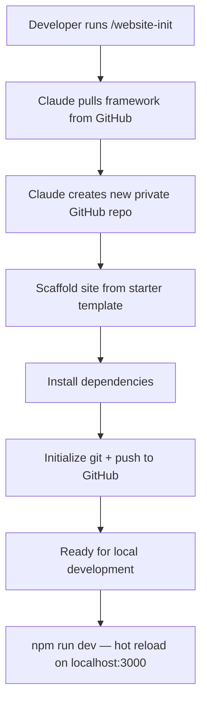
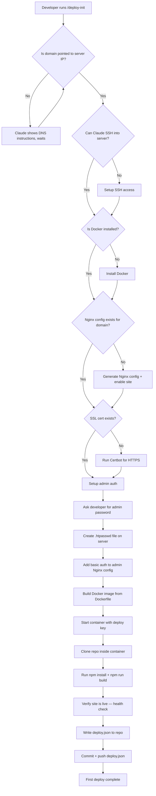
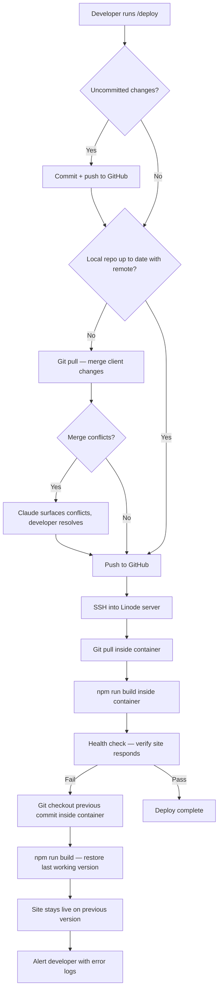
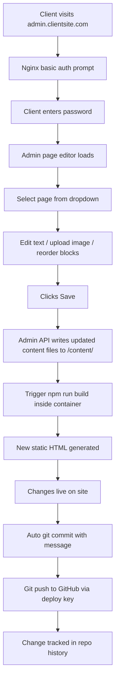
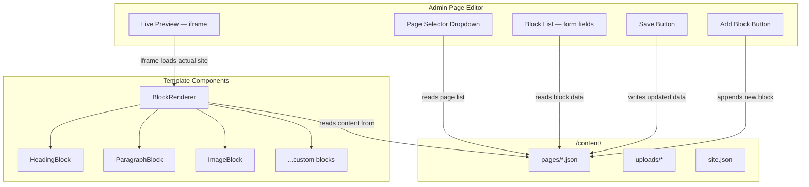
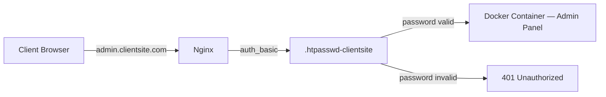
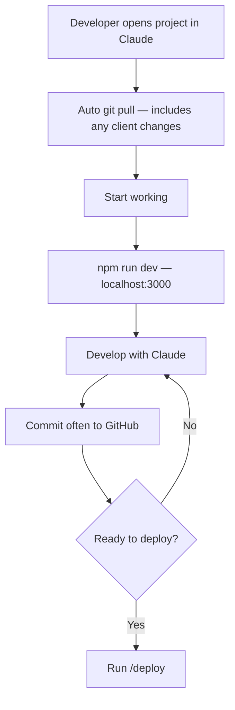
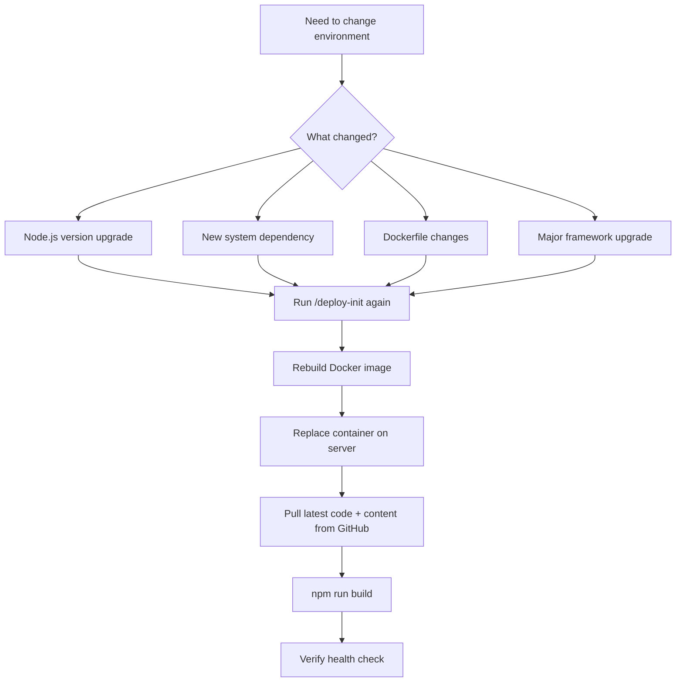
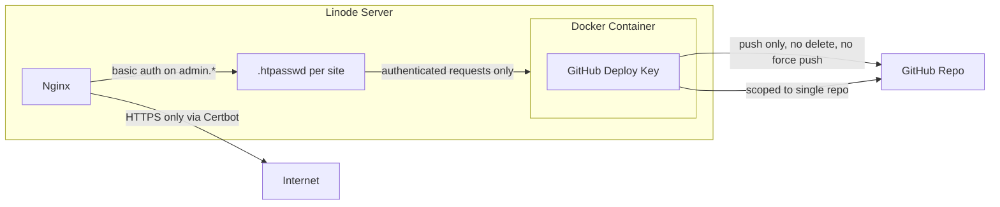

# Website Framework — Architecture

## System Overview

```mermaid
graph TB
    subgraph LOCAL["Developer Machine"]
        DEV[Developer + Claude]
        LOCAL_REPO[Local Git Repo]
        DEV -->|works on code| LOCAL_REPO
    end

    subgraph GH["GitHub (Private Repo)"]
        REMOTE_REPO[Remote Repository]
    end

    subgraph LINODE["Linode Ubuntu Server"]
        NGINX[Nginx Reverse Proxy + SSL + Admin Auth]
        subgraph DOCKER["Docker Container"]
            REPO[Git Repo Clone]
            NEXTJS[Next.js App]
            ADMIN[Admin Panel]
            CONTENT[/content/ files]
            STATIC[Static HTML Output]
        end
    end

    subgraph CLIENT["Client Browser"]
        SITE_VIEW[Views Website]
        ADMIN_VIEW[Admin Page Editor]
    end

    LOCAL_REPO -->|git push| REMOTE_REPO
    REMOTE_REPO -->|git pull| REPO
    REPO --> NEXTJS
    NEXTJS -->|npm run build| STATIC
    NGINX -->|reverse proxy| DOCKER
    NGINX -->|basic auth on admin subdomain| ADMIN
    CLIENT -->|clientsite.com| NGINX
    CLIENT -->|admin.clientsite.com| NGINX
    ADMIN -->|writes content files| CONTENT
    CONTENT -->|auto commit + push| REMOTE_REPO
```

---

## Project Setup Flow (`/website-init`)



---

## First Deploy Flow (`/deploy-init`)



---

## Developer Deploy Flow (`/deploy`)



---

## Client Edit Flow (Admin Panel)



---

## Admin Panel — Page Editor Architecture



### The Contract

The admin panel and the template are decoupled. They only share `/content/` files.

- **Admin panel** reads and writes content files — doesn't know or care about CSS frameworks or styling
- **Template** reads content files and renders them — any framework, any styles
- **Preview** is an iframe of the actual site — always accurate regardless of template

### Content File Format

```json
{
  "title": "About",
  "slug": "about",
  "blocks": [
    { "id": "b1", "type": "heading", "text": "About Me" },
    { "id": "b2", "type": "paragraph", "text": "I design things..." },
    { "id": "b3", "type": "image", "src": "/uploads/portrait.jpg", "alt": "Portrait" }
  ]
}
```

### Template Contract (only requirement)

Every template must implement a `BlockRenderer` that handles content block types:

```
BlockRenderer reads block.type → renders with template-specific styling
```

This means the admin panel works with any CSS framework (Tailwind, Bootstrap, vanilla CSS, etc.) because it never touches the rendering — it only edits the data.

---

## Admin Authentication — Nginx Basic Auth



### Nginx Config for Admin Subdomain

```nginx
server {
    server_name admin.clientsite.com;

    auth_basic "Admin";
    auth_basic_user_file /etc/nginx/.htpasswd-clientsite;

    location / {
        proxy_pass http://localhost:3001;
    }

    # SSL managed by Certbot
}
```

### Why Nginx Basic Auth

- Zero auth code in the framework
- Zero auth bugs — battle-tested
- Password change is one command on the server
- HTTPS via Certbot encrypts credentials in transit
- One less thing to build per site
- Works with any template

---

## Developer Starts Working (Daily Flow)



---

## Docker Image Rebuild (Rare)



---

## Starter Template — 3 Page Portfolio

```
/content/pages/
  home.json       ← hero section, intro text, featured work
  about.json      ← bio, skills, portrait
  contact.json    ← contact info, form or links

/content/site.json ← site name, nav links, fonts, colors
```

---

## File Structure (Inside Each Site Repo)

```
site-repo/
├── app/                    # Next.js pages + routes
│   ├── layout.tsx
│   ├── page.tsx
│   └── [slug]/
│       └── page.tsx
├── components/             # React components
│   ├── Header.tsx
│   ├── Footer.tsx
│   ├── BlockRenderer.tsx
│   └── blocks/
│       ├── TextBlock.tsx
│       ├── ImageBlock.tsx
│       ├── HeadingBlock.tsx
│       └── ...
├── admin/                  # Admin page editor
│   ├── app/
│   ├── components/
│   └── api/
├── content/                # Client-editable content
│   ├── pages/
│   │   ├── home.json
│   │   ├── about.json
│   │   └── contact.json
│   ├── uploads/            # Client-uploaded images
│   └── site.json           # Site-wide config (name, fonts, colors)
├── public/                 # Static assets
├── styles/                 # Global styles
├── deploy.json             # Deployment config (created by /deploy-init)
├── Dockerfile
├── docker-compose.yml
├── next.config.js
├── package.json
└── README.md
```

---

## Security Model


